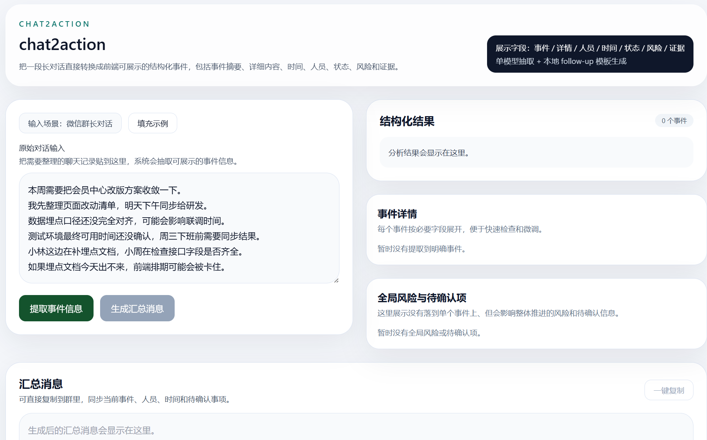
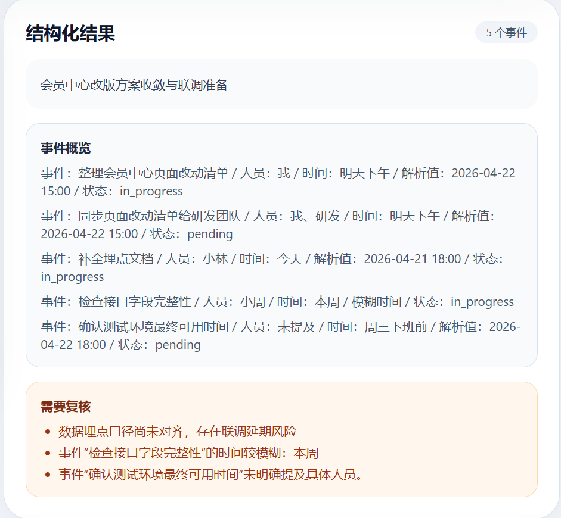
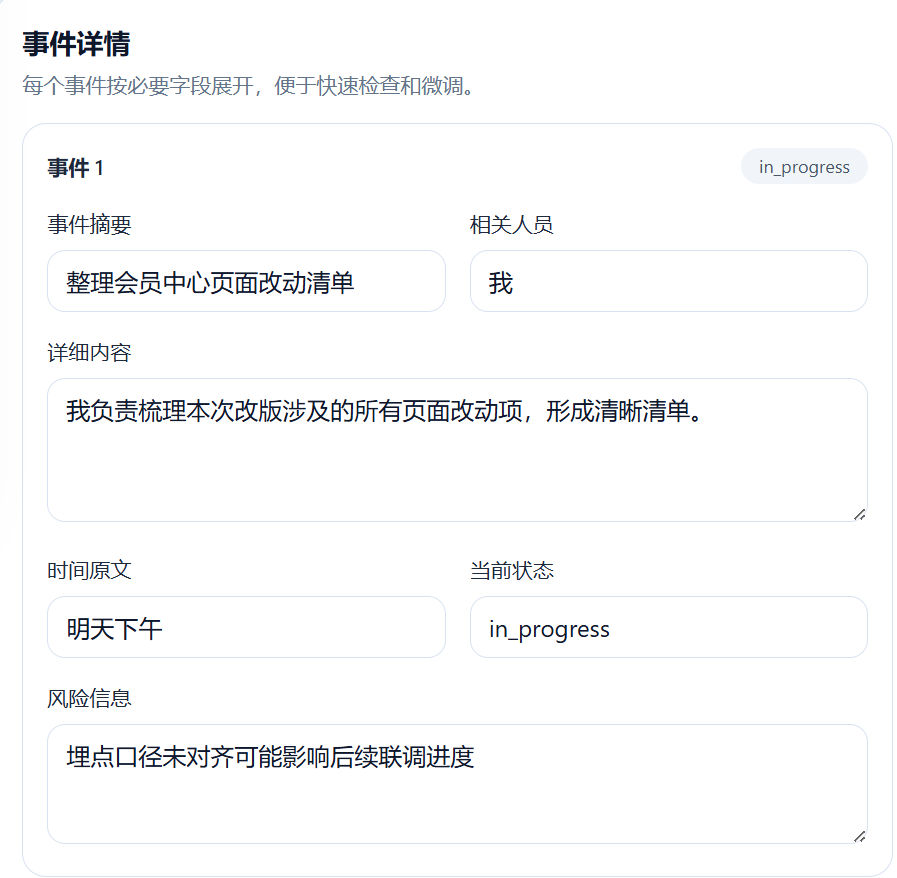
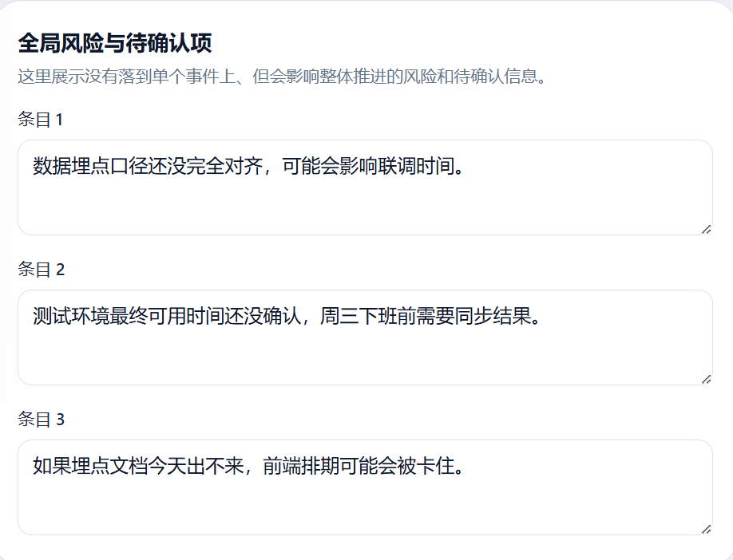
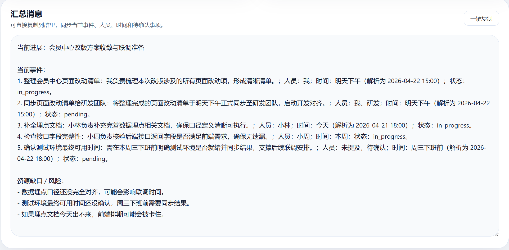

# chat2action

`chat2action` 是一个把长对话直接整理成结构化事件面板的 AI Demo。

它面向一个很常见的协作场景：微信群、项目讨论、需求同步、推进记录里往往包含大量有效信息，但这些信息通常还需要人工再整理，才能变成可执行的事项。这个项目的目标，就是把这一步尽量自动化。

用户只需要粘贴一段长对话，系统就会提取并展示：

- 事件摘要
- 相关人员
- 详细内容
- 时间原文
- 当前状态
- 风险信息
- 全局风险与待确认项
- 可直接发送的汇总消息

和传统“聊天总结”不同，`chat2action` 更关注“事件盘点 + 风险识别 + 跟进输出”，而不是泛化摘要。

## Demo 展示

### 1. 主界面

左侧输入原始对话，右侧展示结构化结果和可编辑事件详情，底部生成汇总消息。



### 2. 结构化结果

系统会先生成一段整体摘要，并列出当前识别到的事件概览，方便快速判断提取质量。



### 3. 事件详情

每个事件都会按字段展开，展示事件摘要、相关人员、详细内容、时间原文、当前状态和风险信息，便于人工复核和微调。



### 4. 全局风险与待确认项

对于没有落到单个事件上、但会影响整体推进的依赖、风险或待确认信息，系统会单独汇总到这一栏。



### 5. 汇总消息

结构化结果可以进一步整理成一段可直接复制发送的汇总消息，用于群内同步或 follow-up。



## 场景示例

输入：

```text
本周需要把会员中心改版方案收敛一下。
我先整理页面改动清单，明天下午同步给研发。
数据埋点口径还没完全对齐，可能会影响联调时间。
测试环境最终可用时间还没确认，周三下班前需要同步结果。
小林这边在补埋点文档，小周在检查接口字段是否齐全。
如果埋点文档今天出不来，前端排期可能会被卡住。
```

系统会重点提取这些信息：

- 当前有哪些事件在推进
- 哪些事件已经出现明确时间要求
- 哪些风险会影响整体推进
- 哪些信息仍然需要人工确认

## 设计原则

- 不强行还原每一个说话人，而是优先提取对推进最有价值的信息
- 对原文没有明确提及的信息，保留为空或标记为待确认
- 不为了让结果“看起来完整”而凭空补负责人、精确时间或额外结论
- 把模型结果直接整理成前端可展示字段，减少中间转换噪声

## 技术栈

- 前端：React + Vite + TypeScript + Tailwind CSS
- 后端：FastAPI + Pydantic
- 模型：DashScope / Qwen 兼容接口

## 项目结构

```text
backend/    FastAPI 服务与抽取逻辑
frontend/   前端页面
tests/      接口与时间解析测试
samples/    示例输入
docs/       截图等展示素材
```

## 本地运行

### 1. 克隆仓库

```bash
git clone https://github.com/yiminghuang277/Chat2Action
cd chat2action
```

### 2. 启动后端

```bash
conda create -n chat2action-backend python=3.11 -y
conda activate chat2action-backend
pip install -r backend/requirements.txt
uvicorn backend.app.main:app --reload --port 8000
```

### 3. 启动前端

```bash
npm install --prefix frontend
npm run frontend:dev
```

启动后访问：

- 前端：`http://127.0.0.1:3000`
- 后端：`http://127.0.0.1:8000`

## 环境变量

复制 `.env.example` 为 `.env`，并填写本地配置：

```env
DASHSCOPE_API_KEY=your_dashscope_api_key
MODEL_NAME=qwen-plus
DASHSCOPE_BASE_URL=https://dashscope.aliyuncs.com/compatible-mode/v1
VITE_API_BASE_URL=http://localhost:8000
```

## API

### `POST /api/analyze`

请求示例：

```json
{
  "source_type": "wechat",
  "raw_text": "整段聊天记录文本",
  "language": "zh-CN"
}
```

返回字段：

- `summary`
- `work_items`
- `resource_gaps`
- `review_flags`

### `POST /api/followup`

输入结构化结果，输出一段可直接发送的汇总消息。

## 测试

后端测试：

```bash
python -m pytest tests/test_api.py tests/test_time_parser.py
```

前端构建检查：

```bash
npm run frontend:build
```
