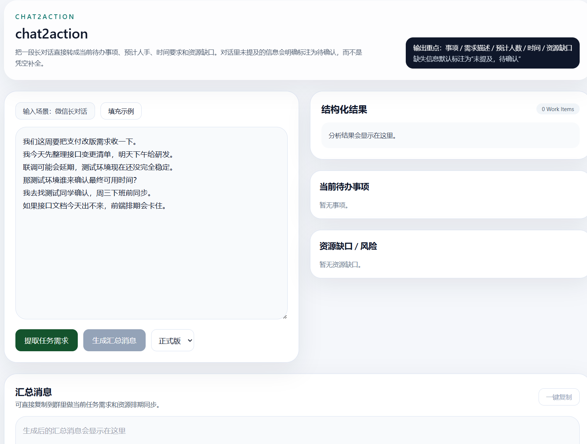
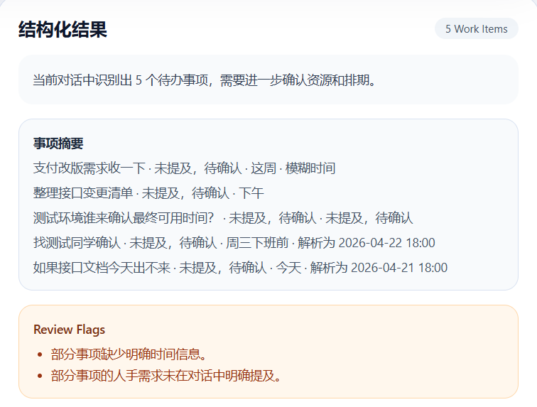
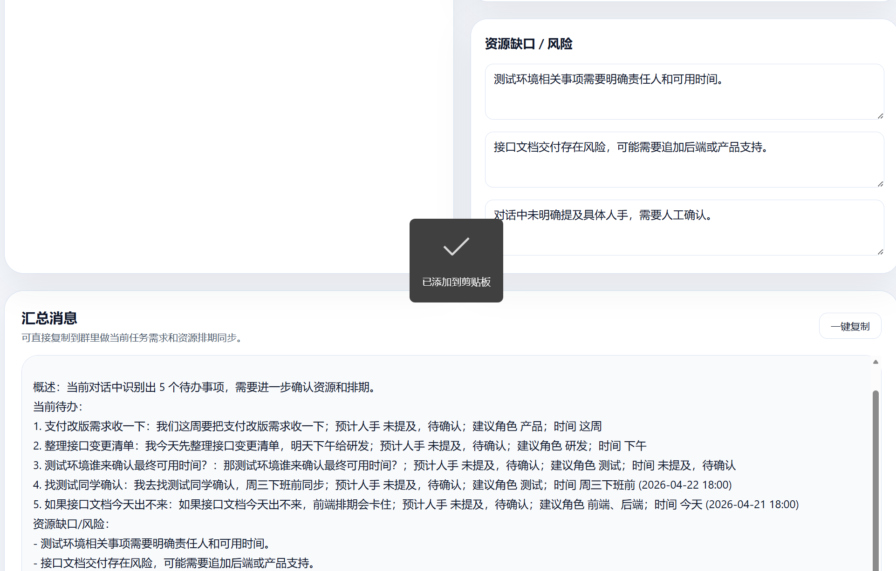

# chat2action

`chat2action` 是一个把长对话转成任务排期视图的 AI Demo。

它面向一个具体且常见的协作场景：微信群聊、需求讨论、项目推进记录中往往包含大量有效信息，但这些信息通常还需要人工再整理，才能真正变成可执行的事项。这个项目的目标，就是把这一步尽量自动化。

用户只需要粘贴一段长对话，系统就会提取并展示：

- 当前待办事项
- 需求描述
- 预计人数
- 建议角色
- 时间要求
- 资源缺口与风险
- 一段可直接发送的 follow-up 消息

和传统“会议总结”不同，`chat2action` 更关注任务盘点和排期视角，而不是泛化摘要。

## 场景示例

输入：

```text
我们这周要把支付改版需求收一下。
我今天先整理接口变更清单，明天下午给研发。
联调可能会延期，测试环境现在还没完全稳定。
那测试环境谁来确认最终可用时间？
我去找测试同学确认，周三下班前同步。
如果接口文档今天出不来，前端排期会卡住。
```

系统会重点提取这些信息：

- 有哪些事项需要继续推进
- 哪些事项的时间已经明确，哪些仍然模糊或待确认
- 哪些事项存在资源缺口
- 当前主要阻塞风险是什么

一个典型的结构化结果会接近下面这样：

```json
{
  "summary": "当前讨论主要围绕支付改版推进、测试环境确认和接口文档风险。",
  "work_items": [
    {
      "title": "整理接口变更清单",
      "description": "整理后同步给研发，用于支付改版推进。",
      "headcount": {
        "raw_text": null,
        "estimated_min": null,
        "estimated_max": null,
        "is_uncertain": true
      },
      "roles": [],
      "schedule": {
        "raw_text": "明天下午",
        "normalized_value": "2026-04-22 15:00",
        "granularity": "day",
        "relation": "deadline",
        "is_uncertain": false,
        "certainty_level": "high"
      },
      "priority": "high",
      "risks": [
        "研发推进依赖该清单"
      ]
    },
    {
      "title": "确认测试环境最终可用时间",
      "description": "联系测试同学确认测试环境最终可用时间，并在周三下班前同步结果。",
      "headcount": {
        "raw_text": null,
        "estimated_min": null,
        "estimated_max": null,
        "is_uncertain": true
      },
      "roles": [],
      "schedule": {
        "raw_text": "周三下班前",
        "normalized_value": "2026-04-22 18:00",
        "granularity": "day",
        "relation": "deadline",
        "is_uncertain": false,
        "certainty_level": "high"
      },
      "priority": "high",
      "risks": [
        "测试环境未稳定，联调可能延期"
      ]
    }
  ],
  "resource_gaps": [
    "测试环境最终可用时间仍需确认",
    "接口文档若未及时产出，会影响前端排期"
  ]
}
```

## Demo 预览

### 首页

展示“左侧原始对话 + 右侧结构化任务表 + 底部 follow-up”整体布局。



### 结果细节

展示任务项中的时间解析、人数待确认、资源缺口和风险提示。




## 设计说明

这个 Demo 不强求“完全还原每个说话人”，而是优先提取在实际协作中更有价值的信息：

- 事情本身是什么
- 还需要哪些资源
- 时间要求是否明确
- 哪些风险正在影响推进

对于聊天记录里没有明确提到的信息，系统会：

- 保留为空
- 标记为待确认
- 或显式标记为不确定

不会为了让结果看起来完整，而凭空补出负责人、人数或精确时间。

后端采用两层策略：

- 优先使用 LLM 进行结构化抽取
- 当模型不可用时，回退到本地 heuristic fallback，保证 Demo 仍可运行

## 功能特性

- 从长对话中提取结构化任务事项
- 抽取需求描述、时间要求、建议角色和风险
- 支持模糊时间表达，如“尽快”“近期”“下周左右”
- 对未提及的人手、角色、时间显示为待确认或不确定
- 识别资源缺口和阻塞问题
- 生成可直接发送的跟进消息
- 支持在线 LLM 解析和本地 fallback 兜底

## 技术栈

- 前端：React + Vite + TypeScript + Tailwind CSS
- 后端：FastAPI + Pydantic
- 模型：DashScope / Qwen 兼容接口
- 兜底策略：本地 heuristic extraction

## 项目结构

```text
backend/    FastAPI 服务与抽取流程
frontend/   前端页面
tests/      接口与时间解析测试
samples/    示例输入
docs/       截图与演示素材
```

## 本地运行

### 1. 克隆仓库

```bash
git clone https://github.com/yiminghuang277/Chat2Action
cd chat2action
```

### 2. 启动后端

```bash
conda create -n chat2action-backend python=3.11 -y
conda activate chat2action-backend
pip install -r backend/requirements.txt
uvicorn backend.app.main:app --reload --port 8000
```

### 3. 启动前端

```bash
npm install --prefix frontend
npm run frontend:dev
```

启动后访问：

- 前端：`http://127.0.0.1:3000`
- 后端：`http://127.0.0.1:8000`

## 环境变量

复制 `.env.example` 为 `.env`，并填写本地配置：

```env
DASHSCOPE_API_KEY=your_dashscope_api_key
MODEL_NAME=qwen-plus
DASHSCOPE_BASE_URL=https://dashscope.aliyuncs.com/compatible-mode/v1
VITE_API_BASE_URL=http://localhost:8000
```

如果没有配置在线模型，系统会回退到本地规则逻辑，仍然可以完成基础演示。

## API

### `POST /api/analyze`

请求示例：

```json
{
  "source_type": "wechat",
  "raw_text": "整段聊天记录文本",
  "language": "zh-CN"
}
```

返回字段：

- `summary`
- `work_items`
- `resource_gaps`
- `review_flags`

### `POST /api/followup`

输入结构化任务结果，输出一段可直接发送的跟进消息。

## 测试

后端测试：

```bash
python -m pytest tests/test_api.py tests/test_time_parser.py
```

前端构建检查：

```bash
npm run frontend:build
```

## 仓库说明

- `.env.example` 只保留示例配置，不包含真实 API Key
- `.gitignore` 已忽略本地依赖、缓存和环境文件
- 截图、录屏 GIF 等展示素材建议统一放在 `docs/` 或 `assets/` 目录
